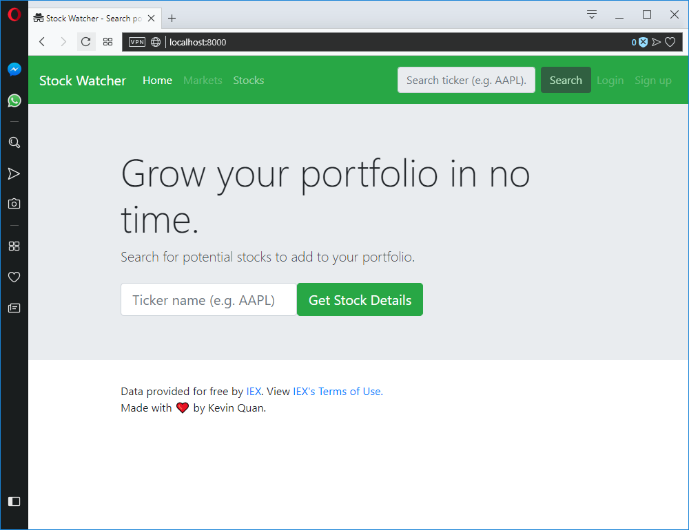

Stock Watcher
=============

A Django application that lists stock information for you to use.

Requirements
------------

This project uses Python 3.7.0 and Django 2.1.

Python can be installed from https://www.python.org/downloads/, and Django can be installed by running pip (as stated `here`_): ``pip install Django==2.1``

Getting started
---------------

Ensure you have the Python and Django installed (see above).

After cloning or downloading this project, you will now need to create a new secret key for this application.

Create a new file called “secrets.py” in the
``stockwatcher/stockwatcher`` folder, then generate a new Django secret key (e.g. by using `this website`_, or by some other method). Add the
following line into your secrets.py file, and replace *<<your secret key>>* with the newly-generated secret key:

``DJANGO_SECRET_KEY = '<<your secret key>>'``

Run the necessary migrations.

After this, start the Django webserver by navigating to the project’s root folder and typing: ``python manage.py runserver``:

Contributing
------------

If you see any bugs, potential bug fixes, or possible new features, they are always welcome and appreciated. 

Please submit a new issue if it is a bug, and a new pull request if it is a new feature (or change to the codebase).

Credits
-------

Front-end framework used: `Bootstrap 4`_

.. _here: https://www.djangoproject.com/download/
.. _this website: https://www.miniwebtool.com/django-secret-key-generator/
.. _Bootstrap 4: https://getbootstrap.com/